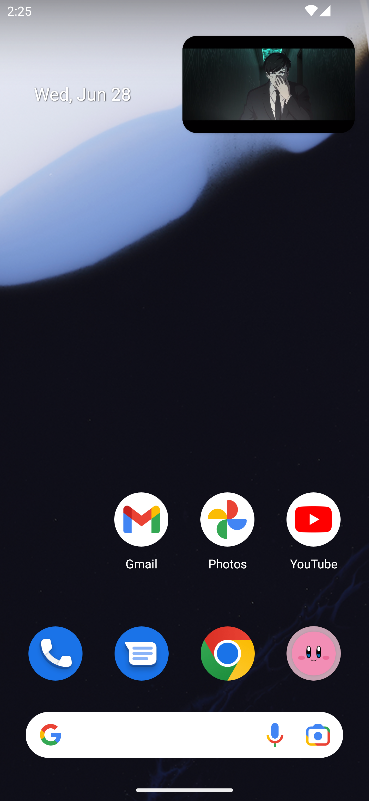

# AnimeStream
A simple app in Material Design to watch anime from [AnimeUnity](https://www.animeunity.it) on your phone.  
Works on Android and iOS (tested), probably in other platforms too.
## Screenshot

  
  
  
  
  
  
  
  
  
  

## Features
- PiP Mode (iOS & Android)
- Dark / Light mode
- OTA Updates (Android)
- Themed icon (Android)
- Swipe controls in player for volume and brightness
- Backup / Restore database
- Use the app and guess you'll find out :D

## Notice
All the anime in the app are ofc with italian sub or dub.

## Download
### Android
You can download the app from the latest release [here](https://github.com/aleeeee1/AnimeStream/releases/latest)

### iOS
To get this running on iOS you need to compile it yourself, sorry :/

## Compiling
### Android
`flutter build apk`

### iOS
You can run on your device without an Apple Developer Licence with `flutter run --release` or compile it with Xcode.  
It will work for a week then you need to reinstall it.

